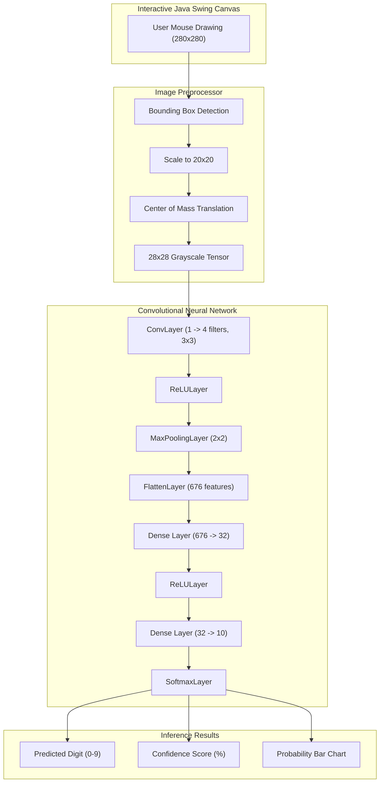

# Handwritten Digit Recognition System: Core Concepts & Architecture

**Course / Project**: Advanced Object-Oriented Programming (AOOP)  
**Implementation**: Pure Java (Java SE 26, Zero External ML Libraries)  
**Domain**: Convolutional Neural Networks (CNN), Linear Algebra, Computer Vision

---

## Table of Contents
1. [Object-Oriented Programming (OOP) Architecture](#1-object-oriented-programming-oop-architecture)
2. [Linear Algebra Engine (Matrix & Tensor)](#2-linear-algebra-engine-matrix--tensor)
3. [Neural Network Layer Hierarchy](#3-neural-network-layer-hierarchy)
4. [Mathematical Theory of Convolution & Pooling](#4-mathematical-theory-of-convolution--pooling)
5. [Backpropagation Calculus & Chain Rule](#5-backpropagation-calculus--chain-rule)
6. [Loss Functions & Optimization](#6-loss-functions--optimization)
7. [MNIST Image Preprocessing & Center of Mass Centering](#7-mnist-image-preprocessing--center-of-mass-centering)
8. [System Pipeline & Execution Flow](#8-system-pipeline--execution-flow)

---

## 1. Object-Oriented Programming (OOP) Architecture

The entire machine learning engine was designed to exhibit clean, extensible, robust object-oriented software engineering principles without third-party frameworks.

### A. Abstraction
- The [`Layer`](file:///c:/Users/vansh/OneDrive/Desktop/HandwrittenDigitCNN/src/layers/Layer.java) interface exposes a strict, minimal abstraction:
  ```java
  public interface Layer extends Serializable {
      Tensor forward(Tensor input);
      Tensor backward(Tensor outputGradient);
      default void updateWeights(double learningRate) {}
      default boolean hasWeights() { return false; }
  }
  ```
- Downstream callers (such as [`NeuralNetwork`](file:///c:/Users/vansh/OneDrive/Desktop/HandwrittenDigitCNN/src/network/NeuralNetwork.java) and [`Trainer`](file:///c:/Users/vansh/OneDrive/Desktop/HandwrittenDigitCNN/src/trainer/Trainer.java)) interact solely with this abstraction, completely shielded from internal matrix transformations or multi-kernel sliding convolutions.

### B. Polymorphism
- `NeuralNetwork` manages a heterogeneous list of polymorphic layer implementations:
  ```java
  List<Layer> layers = new ArrayList<>();
  ```
- During forward inference and backward error propagation, dynamic dispatch invokes the specific behavior of `ConvolutionLayer`, `ReLULayer`, `MaxPoolingLayer`, `FlattenLayer`, `FullyConnectedLayer`, or `SoftmaxLayer` seamlessly through identical method signatures.

### C. Encapsulation
- Weight tensors, bias vectors, cached forward activations, and gradient accumulators (`dW`, `dB`, `dFilters`) are declared `private` or `protected`.
- State transitions are strictly validated through methods such as `setValue(int r, int c, double val)` with dimension checking to prevent silent array index out of bounds or shape mismatch bugs.

### D. Design Patterns Applied
1. **Pipeline / Composite Pattern**: `NeuralNetwork` composes individual `Layer` instances into an executable sequential pipeline.
2. **Factory / Builder Pattern**: [`ModelBuilder`](file:///c:/Users/vansh/OneDrive/Desktop/HandwrittenDigitCNN/src/utils/ModelBuilder.java) encapsulates network topologies (`buildCNN()`, `buildFastCNN()`, `buildMLP()`).
3. **Observer / Listener Pattern**: [`TrainingCallback`](file:///c:/Users/vansh/OneDrive/Desktop/HandwrittenDigitCNN/src/trainer/TrainingCallback.java) decouples the `Trainer` engine from GUI progress bars and terminal logs.

---

## 2. Linear Algebra Engine (Matrix & Tensor)

Neural networks are mathematical transformations of high-dimensional vector spaces.

### A. 2D Matrix Engine (`Matrix.java`)
Represents a 2D numerical grid ($R \times C$).
- **Matrix Multiplication**:
  $$(A \cdot B)_{ij} = \sum_{k=1}^{K} A_{ik} B_{kj}$$
  Where $A \in \mathbb{R}^{M \times K}$ and $B \in \mathbb{R}^{K \times N}$ yielding $C \in \mathbb{R}^{M \times N}$.
- **Transposition**:
  $$(A^T)_{ji} = A_{ij}$$
  Swaps rows and columns. Transposition is fundamental during backpropagation to reverse parameter transformations.
- **Hadamard Product**:
  $$(A \odot B)_{ij} = A_{ij} \times B_{ij}$$
  Element-wise product used for gating activation derivatives (e.g., ReLU).

### B. 3D Tensor Engine (`Tensor.java`)
Represents spatial volumetric data with dimensions:
$$\text{Shape} = (C \times H \times W)$$
Where:
- $C$: Number of feature channels ($1$ for grayscale MNIST image; $4$ or $8$ for intermediate convolutional filter maps).
- $H$: Height in pixels.
- $W$: Width in pixels.
- Supports 2D slice extraction (`getChannel(int c)`), spatial reshaping, and continuous flattening into 1D row vectors for dense layer consumption.

### C. Weight Initializations
- **Xavier / Glorot Uniform**:
  $$W \sim U\left(-\sqrt{\frac{6}{N_{in} + N_{out}}}, +\sqrt{\frac{6}{N_{in} + N_{out}}}\right)$$
  Maintains unit variance of activations across layers with linear/sigmoid/softmax functions.
- **He / Kaiming Normal**:
  $$W \sim \mathcal{N}\left(0, \sqrt{\frac{2}{N_{in}}}\right)$$
  Specifically designed to prevent vanishing gradients in deep networks utilizing non-linear ReLU activations.

---

## 3. Neural Network Layer Hierarchy

```text
                             <<interface>>
                                 Layer
                                   │
      ┌──────────────┬─────────────┼───────────────┬──────────────┬─────────────┐
      ▼              ▼             ▼               ▼              ▼             ▼
ConvolutionLayer  ReLULayer  MaxPoolingLayer  FlattenLayer  FullyConnected  SoftmaxLayer
```

1. **ConvolutionLayer**: Extracts local topological features (edges, arcs, corners) via spatial filter kernels.
2. **ReLULayer**: Introduces non-linearity so deep representations do not collapse into a single linear matrix multiplication.
3. **MaxPoolingLayer**: Downsamples spatial resolution, cuts parameter space, and introduces translation invariance.
4. **FlattenLayer**: Reshapes multi-channel 3D feature tensors $(C \times H \times W)$ into a 1D vector $(1 \times (C \cdot H \cdot W))$.
5. **FullyConnectedLayer**: Dense linear mapping $Y = X \cdot W + B$ combining spatial features into class decisions.
6. **SoftmaxLayer**: Converts raw unconstrained scores (logits) into a true probability distribution summing to $1.0$.

---

## 4. Mathematical Theory of Convolution & Pooling

### A. 2D Convolution Operation
Given input tensor $X$ with $C_{in}$ channels and a bank of $C_{out}$ filters where each filter has spatial kernel size $K \times K$:
$$Y_{f, oh, ow} = B_f + \sum_{c=0}^{C_{in}-1} \sum_{kh=0}^{K-1} \sum_{kw=0}^{K-1} X_{c, \, oh \cdot S - P + kh, \, ow \cdot S - P + kw} \times K_{f, c, kh, kw}$$
Where:
- $S$: Stride (step size)
- $P$: Zero-padding
- Output dimensions:
  $$H_{out} = \left\lfloor \frac{H_{in} - K + 2P}{S} \right\rfloor + 1, \quad W_{out} = \left\lfloor \frac{W_{in} - K + 2P}{S} \right\rfloor + 1$$

### B. Max Pooling Operation
For a window of size $p \times p$ with stride $s$:
$$Y_{c, oh, ow} = \max_{0 \le kh, kw < p} X_{c, \, oh \cdot s + kh, \, ow \cdot s + kw}$$
During forward evaluation, `MaxPoolingLayer` saves the argmax indices $(r^*, c^*)$ of the winning element. During backpropagation, the incoming gradient is routed **only** to the argmax position, while non-maximal entries receive zero gradient.

---

## 5. Backpropagation Calculus & Chain Rule

Backpropagation is the algorithmic computation of partial derivatives using the multivariate chain rule:
$$\frac{\partial L}{\partial \theta} = \frac{\partial L}{\partial Y} \cdot \frac{\partial Y}{\partial \theta}$$

### A. Fully Connected (Dense) Layer
Let the forward equation be:
$$Y = X \cdot W + B$$
Given upstream gradient $dY = \frac{\partial L}{\partial Y}$:
1. **Weight Gradient**:
   $$\frac{\partial L}{\partial W} = X^T \cdot dY$$
2. **Bias Gradient**:
   $$\frac{\partial L}{\partial B} = \sum_{\text{rows}} dY$$
3. **Input Gradient** (propagated backward):
   $$\frac{\partial L}{\partial X} = dY \cdot W^T$$

### B. ReLU Layer
Given activation function $y = \max(0, x)$:
$$\frac{\partial L}{\partial x} = \begin{cases} \frac{\partial L}{\partial y} & \text{if } x > 0 \\ 0 & \text{if } x \le 0 \end{cases}$$

### C. Softmax Layer
Given logits $z$ and predicted probabilities:
$$p_i = \frac{e^{z_i - \max(z)}}{\sum_j e^{z_j - \max(z)}}$$
The Jacobian matrix entries are:
$$\frac{\partial p_i}{\partial z_j} = p_i (\delta_{ij} - p_j)$$
Thus for incoming gradient $dY$:
$$\frac{\partial L}{\partial z_i} = p_i \left( dY_i - \sum_j dY_j \cdot p_j \right)$$

---

## 6. Loss Functions & Optimization

### A. Categorical Cross-Entropy Loss
For true one-hot distribution $Y$ and predicted probability $P$:
$$L = -\sum_{i=0}^{C-1} Y_i \ln(P_i + \epsilon)$$
Where $\epsilon = 10^{-15}$ prevents numeric instability from $\ln(0)$.

### B. Combined Softmax + Cross-Entropy Gradient
When Softmax is the output activation and Cross-Entropy is the loss, the analytical gradient with respect to pre-softmax logits $Z$ simplifies cleanly:
$$\frac{\partial L}{\partial Z_i} = P_i - Y_i$$
This is numerically stable and computationally instantaneous.

### C. Mini-Batch Stochastic Gradient Descent (SGD)
Parameters $\theta \in \{W, B, \text{Kernels}\}$ are updated in the direction of steepest descent:
$$\theta \leftarrow \theta - \frac{\alpha}{B} \sum_{i=1}^{B} \frac{\partial L_i}{\partial \theta}$$
Where:
- $\alpha$: Learning rate (e.g. $0.01$)
- $B$: Mini-batch size

---

## 7. MNIST Image Preprocessing & Center of Mass Centering

A standard convolutional network trained on MNIST expects standardized digits. If a user sketches a small digit in the corner of a drawing canvas, raw resizing will distort or misalign it.

[`ImagePreprocessor.java`](file:///c:/Users/vansh/OneDrive/Desktop/HandwrittenDigitCNN/src/preprocessing/ImagePreprocessor.java) executes the exact 4-step MNIST standardization algorithm:
1. **Bounding Box Isolation**: Scans canvas pixels for non-zero luminosity to find $[minX, maxX, minY, maxY]$.
2. **Aspect Ratio Preserving Scaling**: Resizes the bounded stroke so its maximum dimension fits within a $20 \times 20$ pixel square.
3. **Center of Mass (Centroid) Calculation**:
   $$\bar{x} = \frac{\sum_{x, y} x \cdot I(x, y)}{\sum_{x, y} I(x, y)}, \quad \bar{y} = \frac{\sum_{x, y} y \cdot I(x, y)}{\sum_{x, y} I(x, y)}$$
4. **Centering onto 28x28 Canvas**: Translates the centroid $(\bar{x}, \bar{y})$ directly to the center coordinates $(14, 14)$ of the $28 \times 28$ tensor.

---

## 8. System Pipeline & Execution Flow



---

## Quick Reference Commands

- **Open Interactive CMD Explainer**:
  ```cmd
  CONCEPTS.cmd
  ```
- **Compile Project**:
  ```cmd
  javac -d bin -sourcepath src src/Main.java test/NetworkTest.java
  ```
- **Run Automated Unit Tests**:
  ```cmd
  java -cp bin test.NetworkTest
  ```
- **Run CLI Demo & ASCII Visualizer**:
  ```cmd
  java -cp bin Main --demo
  ```
- **Launch Interactive Swing Drawing Canvas**:
  ```cmd
  java -cp bin Main --gui
  ```
